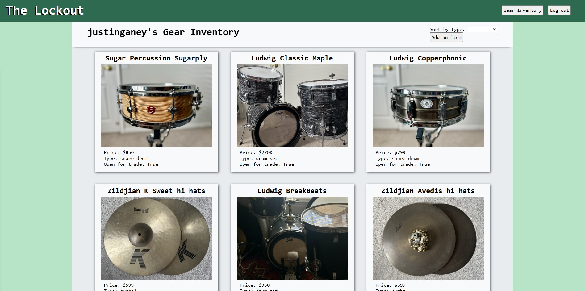
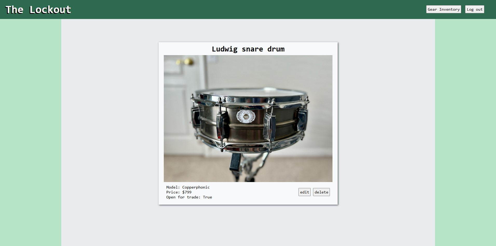

## The Lockout Music Gear App - [View the app!](https://the-lockout-495998d8d4a1.herokuapp.com/)

## Description 🥁
The lockout is a Django application that allows users to add and manage their inventory of music gear that they own. 

## Screenshots 📸

#### Gear Index Page

#### Gear Detail Page

## Technologies Used 👽

## Future Improvements 📈
- [ ] Add another model to group gear items together 
- [ ] Categorize by type of instrument and solidify types for each category to eliminate bad inputs
- [ ] Show other users inventories and add trading capabilities

